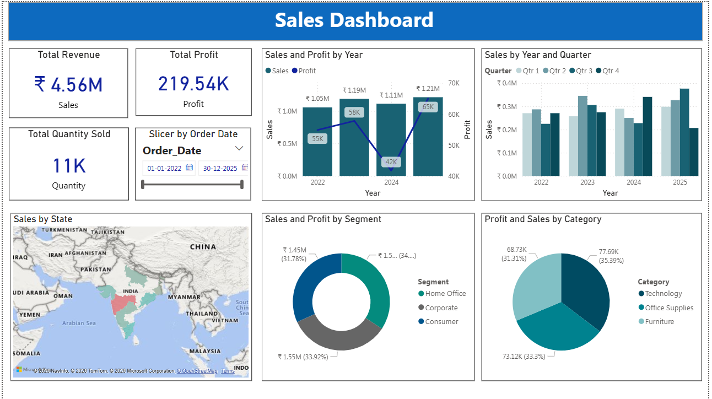
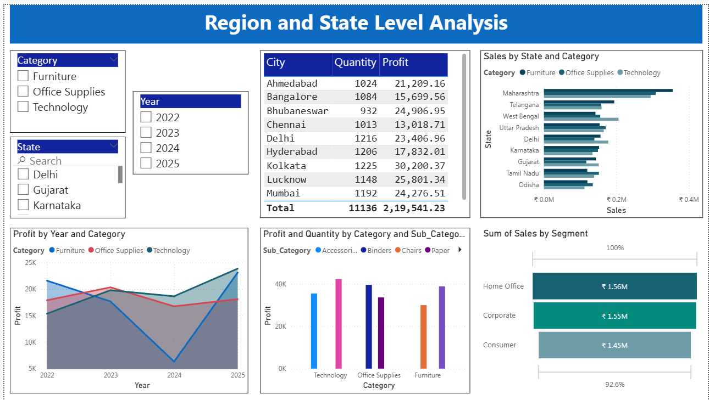
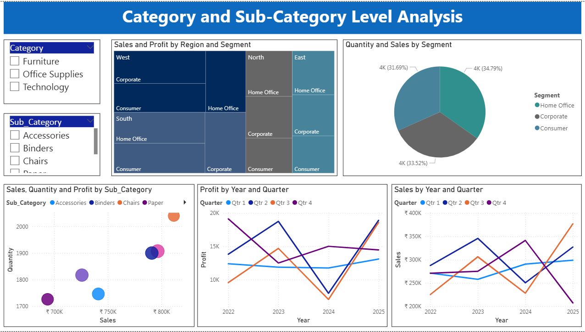

# 📊 Superstore Sales Dashboard (Power BI)

## 📌 Project Overview

This project presents an **interactive Sales Dashboard built using Power BI** to analyze sales performance using a Superstore dataset.

The dashboard provides insights into **sales trends, profit analysis, category performance, customer segments, and regional sales distribution**.

---

## 🎯 Objectives

* Analyze overall **sales and profit performance**
* Identify **top-performing categories and segments**
* Perform **regional and state-level sales analysis**
* Understand **sales trends over time**

---

## 🛠 Tools & Technologies

* Power BI
* DAX (Data Analysis Expressions)
* Data Modeling
* Excel Dataset

---

## 📊 Dataset

The dataset contains **2000 records** with fields such as:

* Order Date
* Ship Date
* Region
* Category
* Sales
* Quantity
* Discount
* Profit
* Customer Details

---

## 📈 Dashboard Features

### 🔹 KPI Metrics

* Total Sales
* Total Profit
* Total Quantity Sold

### 🔹 Sales Trend Analysis

* Sales and Profit by Year
* Sales by Year and Quarter

### 🔹 Regional Analysis

* State-wise Sales Map
* Region and State Level Analysis

### 🔹 Category Analysis

* Profit and Sales by Category
* Sub-Category Performance

### 🔹 Segment Analysis

* Sales by Customer Segment
* Quantity and Sales by Segment

### 🔹 Interactive Slicer

* Category
* Year
* State

---

## 📊 Calculated Columns (DAX)

The following calculated columns were created using DAX:

* Year
* Quarter
* Month
* Day of Week
* Weekday / Weekend
* Days for Shipment
* Full Name (Customer)

---

## 📷 Dashboard Preview

### Overall Sales Dashboard

### Region and State Analysis

### Category and Sub-Category Analysis

---

## 🚀 Author

**Ravindra Mhetre**

Aspiring **Data Analyst** passionate about data visualization, business insights, and analytics.
